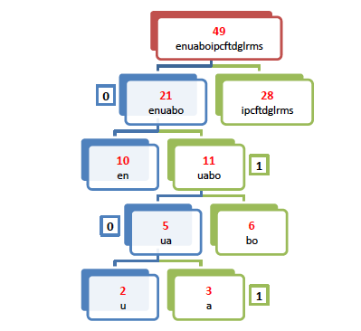
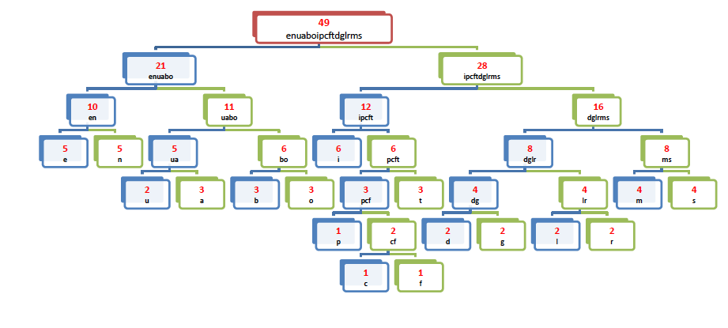

# Huffman Code
Huffman code is a type of optimal prefix code that is commonly used for lossless data compression. The
algorithm has been developed by **David A. Huffman**. The technique works by creating a binary tree of
nodes.
## Concept 
The main idea is to transform plain input into variable-length code. More frequent symbols are generally
represented using fewer bits than less frequent symbols. The easiest way to understand how to create
Huffman tree is to analyze following steps:
1. Scan text for symbols (e.g. 1-byte characters) and calculate their frequency of occurrence.
2. Start a loop.
3. Find two smallest probability nodes and combine them into single node.
4. Remove those two nodes from list and insert combined one.
5. Repeat the loop until the list has only one single node.
6. This last single node represents a Huffman tree.

## Use Case

Let us consider the example where the input file contains the following sentence:

> **a simple string to be encoded using a minimal number of bits**

Step 1 starts by scanning the input file and returning a simply linked list. This list contains the available
characters along with their frequency of occurrence. Once it is sorted according to the frequencies of
occurrence and the lexicographic order, the simply linked list holds the following information:

| 1 | 1 | 1 | 2 | 2 | 2 | 2 | 2 | 3 | 3 | 3 | 3 | 4 | 4 | 5 | 5 | 6 |
|---|---|---|---|---|---|---|---|---|---|---|---|---|---|---|---|---|
| c | f | p | d | g | l | r | u | a | b | o | t | m | s | e | n | i |

We select the two nodes with the least frequencies and we replace them with one single node
combining the previous two nodes. In our example, we select nodes ‘c’ and ‘f’, and we replace them
with the node ‘cf’ where the frequency is set to be equal to the sum of the two previous frequencies.
The new node is inserted back into the simply linked list while keeping it sorted according to the
frequencies of occurrence and the lexicographic order. The resulting list is as follows:

| 1 | 2  | 2 | 2 | 2 | 2 | 2 | 3 | 3 | 3 | 3 | 4 | 4 | 5 | 5 | 6 |
|---|----|---|---|---|---|---|---|---|---|---|---|---|---|---|---|
| p | ¤  | d | g | l | r | u | a | b | o | t | m | s | e | n | i |
|   | cf |   |   |   |   |   |   |   |   |   |   |   |   |   |   |

These steps are repeated again and again until we end up with one single node. Now, we combine
nodes ‘p’ and ‘cf’ into one single node and add up there frequencies. The resulting list is as follows:

| 2 | 2 | 2 | 2 | 2 | 3 | 3 | 3 | 3   | 3 | 4 | 4 | 5 | 5 | 6 |
|---|---|---|---|---|---|---|---|-----|---|---|---|---|---|---|
| d | g | l | r | u | a | b | o | ¤   | t | m | s | e | n | i |
|   |   |   |   |   |   |   |   | pcf |   |   |   |   |   |   |


The next step is to combine nodes ‘d’ and ‘g’ into one single node and add up their frequencies. The
resulting list is as follows:

| 2 | 2 | 2 | 3 | 3 | 3 | 3   | 3 | 4  | 4 | 4 | 5 | 5 | 6 |
|---|---|---|---|---|---|-----|---|----|---|---|---|---|---|
| l | r | u | a | b | o | ¤   | t | ¤  | m | s | e | n | i |
|   |   |   |   |   |   | pcf |   | dg |   |   |   |   |   |

At the end of this modification process, the result can be represented as a binary tree as follows:



In the previous figure, the single root node is represented in red, the left child is represented in blue and
the right child is represented in green. In order to get the Huffman code of any character, it is sufficient
to go through the binary tree and assign the integer number 0 to each left child and the integer number
1 to each right child. Thus, the Huffman code associated with the character ‘a’ would be ‘0101’ as
depicted in the figure below:



The Huffman codes of all the characters present in the original text is the following:

* a : 0 1 0 1
* b : 0 1 1 0
* c : 1 0 1 0 1 0
* d : 1 1 0 0 0
* e : 0 0 0
* f : 1 0 1 0 1 1
* g : 1 1 0 0 1
* i : 1 0 0
* l : 1 1 0 1 0
* m : 1 1 1 0
* n : 0 0 1
* o : 0 1 1 1
* p : 1 0 1 0 0
* r : 1 1 0 1 1
* s : 1 1 1 1
* t : 1 0 1 1
* u : 0 1 0 0

## Assignment

Your task is to write down the following 5 functions defined in the file **StdFunctions.cpp**.

```
Node* ReadFile(const char* fileName);

Node* IncFrequency(Node* Head, char c);

void Sort(Node* Head);

Node* InsertSorted(Node* Head, Node* elt);

Node* SearchTree(Node* Tree, std::string C);

```
Please check the file **StdFunctions.cpp** for the detailed description of these functions.
You are not allowed to modify the other files unless you want to add new functionalities to the code.
Please submit your code to your instructors by mail the day before your project defense.


